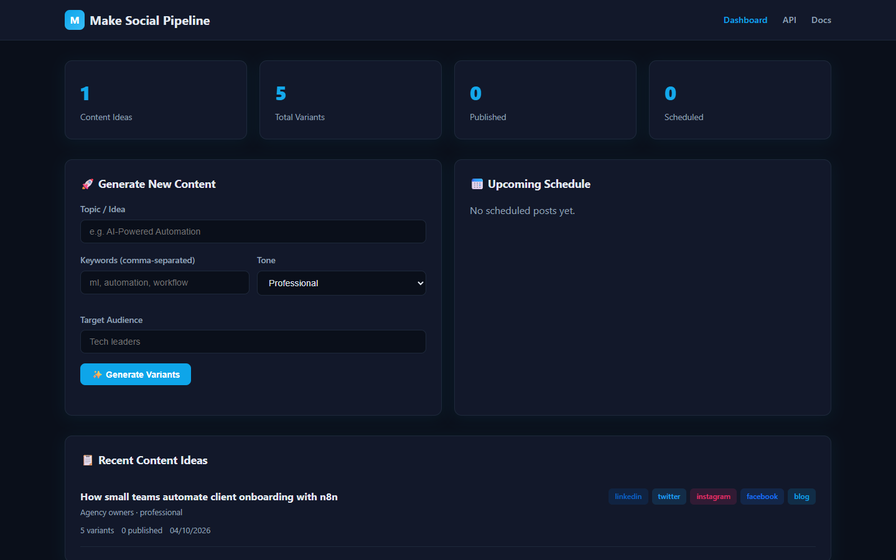
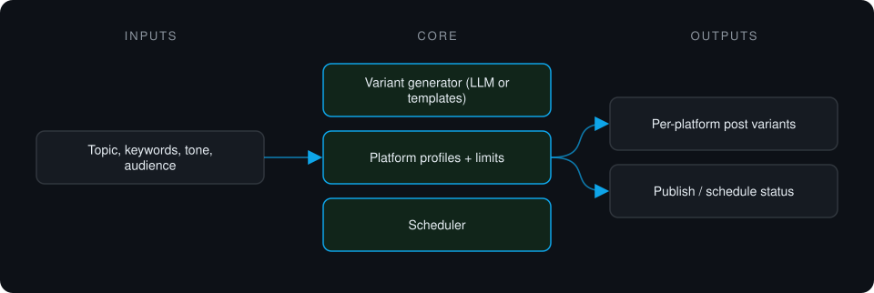
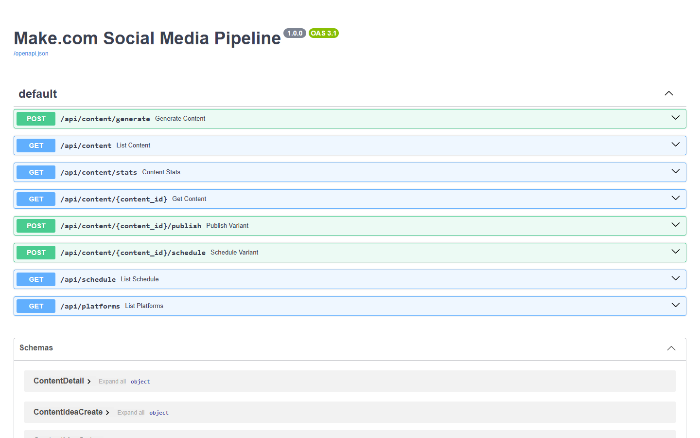

# Make Social Media Pipeline

**Turns one content idea into platform-appropriate post variants for LinkedIn, X, Instagram, Facebook and a blog. Generation is template-based and publishing is mocked in this version.**

> **This is a proprietary project. Source code is private. This page showcases the system's architecture and results.**

**Case study page:** [https://jryahia.github.io/showcase-make-social-media-pipeline/](https://jryahia.github.io/showcase-make-social-media-pipeline/)

## Problem it solves

Rewriting the same idea five times for five platforms is repetitive. This pipeline generates per-platform variants that respect each platform's limits and tone, then tracks publishing. It is built as the webhook backend for a Make.com scenario: the automation platform handles triggers, and this service holds the logic and data.

## Architecture

1. A content idea is submitted with keywords, tone and audience.
2. Variants are generated per platform within each platform's limits.
3. Variants can be previewed, then published or scheduled.
4. Status is tracked per variant.

## Key features

- Five platform targets from one idea
- Per-platform character and format rules
- Works with or without an LLM key
- Publishing and scheduling pipeline
- Content stats

## Tech stack

    

## What it does in practice

- Prototype stage: variant generation within each platform's limits works end to end; publishing and scheduling run against a mock client.

## Screenshots

**One idea, five platform variants**

**API surface: generation, variants, publish and schedule**

---

Built by [Yahya Jarray](https://github.com/jryahia). Interested in a similar system? [Get in touch](mailto:yahiajarray43@gmail.com).

This repository contains no source code. It is a case study for a proprietary project. © Yahya Jarray.
